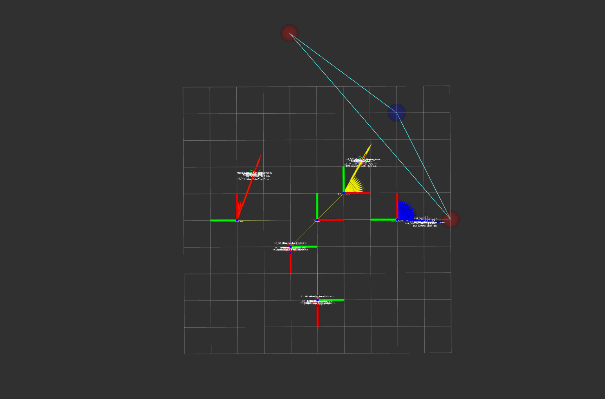
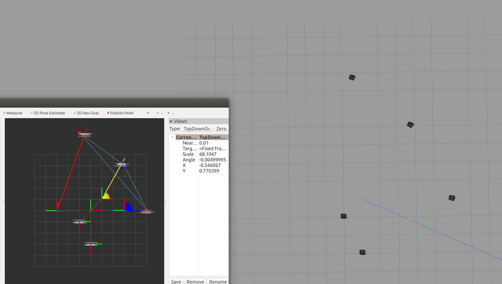
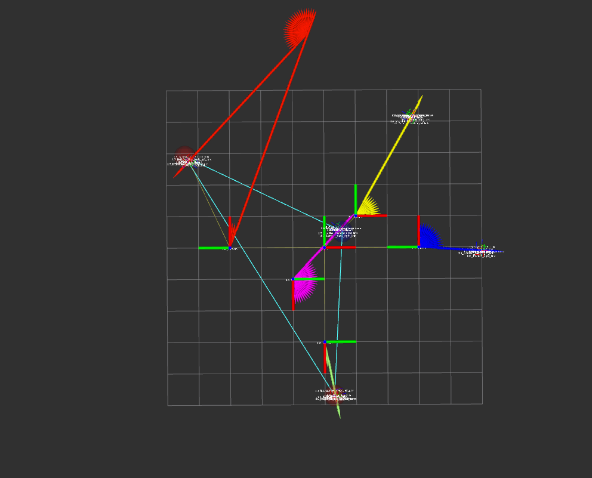
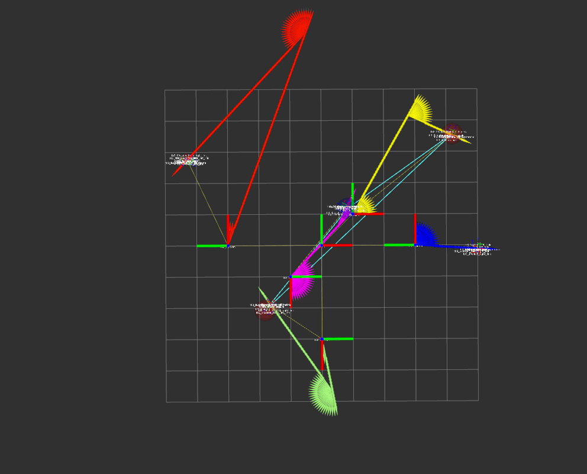
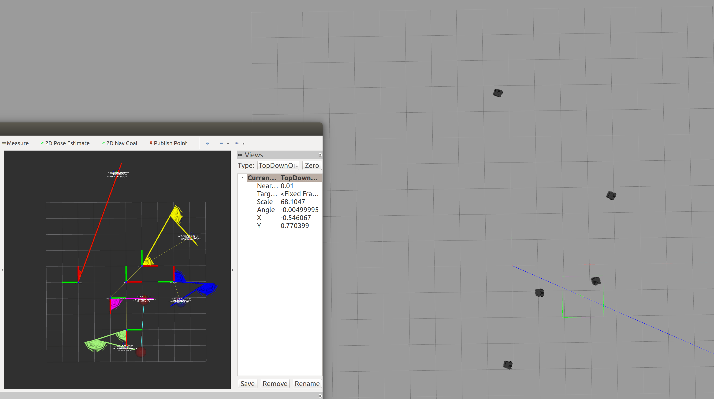

# Connectivity ROS package
### CS269 Multi Robot Systems / 2021 Spring / PA-5
### Mingi Jeong / mingi.jeong.gr@dartmouth.edu

## 1. General
* This package achieves connection map building (steiner tree) by robots and goal tasks(waypoint positions) by five robots. The allocation is mainly based on variant of auction in PA-4. However, the algorithm does not allow one robot to be assigned to more than one location to ensure connectivity.  
* There are two launch files: one launch file (`roslaunch connectivity_pkg connectivity_environment.launch`) can run all the environments and TF connection nodes, while the other launch file (`roslaunch connectivity_pkg waypoint_send.launch random_generate:=BOOL`) has a role of publishing waypoints (including terminal nodes and connection nodes) based on steiner tree approximation algorithm.
* It is robust to achieve random waypoints sent by ROS topic `/waypoints`, if an user setup `random_generate` as True. 
* It also pops up Rviz node automatically and users can easily monitor the task performance. The terminal nodes are visualized in red, while the connection nodes in blue.
<div style="text-align:center">
</div>
<div style="text-align:center">Initialization of connectivity problem (predefined) -- red ball: terminal nodes, blue ball: connection node</div>


## 2. Method
1. Assumption
    * In principle, all the set ups of robots and systems are followed by PA-4. I will minimize the repetition of explanation.
    * I am using five robots in Gazebo. In other words, I am initially building a graph with total 5 nodes.
    * The _turtlebot3_waffle_pi_ model has been modified to use __encoder__ for odometry data. This is included in __custom_turtlebot3_description__ package.
    * The user starts robots with prior knowledge of initial positions and orientations of five robots with respect to the world frame. This is included in __connectivity_environment.launch__. For example, the followings are first robot's argument for that pose. 
    * The user can modify this on the terminal while launching the nodes; however, it is advisable to modify in the launch file as there are total 3*5 = 15 arguments (except for z) to test spawn.    
    
        ```
        <arg name="first_tb3_x_pos" default="-3.0"/>
        <arg name="first_tb3_y_pos" default="0.0"/>
        <arg name="first_tb3_z_pos" default=" 0.0"/>
        <arg name="first_tb3_yaw"   default=" 1.57"/>
        ```
    * The auctioneer robot is designated as `/tb3_0` as the lowest index number and all the robots including `0` are bidder robots who participated in a bid at each round.
    * For an each auction round to determine which robot is to be assigned, I don't consider the communication limitation like reachable range, in that all the robots can communicate with the auctioneer robot. 
    * Moreover, __different from PA-4__, I used a variant of auctions to assign only one node to a robot. If one robot won a previous round, the robot would give __infinity__ costs for all the  tasks. This is to ensure connectivity where assigned robots are deployed at _connection nodes_ or _terminal nodes_. 
    * After all rounds are completed, the auctioneer robot triggers the movements of the whole team.

2. Start
    * Based on the above initial position arguments, (1) they are used for spawning robots in Gazebo for those poses, (2) they are passed to __connectivity_robot__ node (`robot_load.launch`) to make connection of TF hierarchy. 
    * This is aligned with an real environment example where an user put three robots in indoor, e. g., in Sudikoff, set the reference frame, measure their poses, and pass them as arguments to do the real tests.
    * Specifically, in __connectivity_robot__ node, the robot saves the initial pose from Rosparam and publishes `/initialpose` topic with message type `geometry_msgs/PoseWithCovarianceStamped` after transforming Euler to quaternion. 
    * Then, __tf_broadcastor__ node receives `/initialpose` topic and broadcast TF whenever (every call back) the message is received. I know the professor mentioned it is not necessary to publish all the time for static TF; however, I haven't changed it for Rviz visualization. I might go ask in office hours for minor comments from PA-3.
    * The connection of TF hierarchy is same as __PA-4__.

3. Task-related
    1. waypoint inputs
    * Note that after `connectivity_environment.launch`, you will see robots in Gazebo and Rviz in addition to robot load and TF connection on the terminal with ros logwarn (visualized in yellow). 
    * Then, on another terminal, if you initiate `waypoint_send.launch random_generate:=BOOL`, it passes randomly generated waypoints -- a position is apart -- more than 2m by constant -- from one another OR pre-defined waypoints. Arguments as `random_generate` can be selected from true or false, whichever you want. This is to build a graph and steiner tree in __network.py__. For each boolean case, I am just using two terminal nodes to see the behavior of (1) finding connection node if it needs to be found for the steiner tree, (2) enabling some member robots to the partial nodes by the auction process.
    * The waypoints are sent via `waypoints` topic with message type `PolygonStamped`, which made it easier to visualize in Rviz. Furthermore, I marked `terminal nodes` in red, while `connection nodes` in blue.

4. Auctioneer and Bidder
    * In principle, I am using a finite state machine to check a certain state is met (e. g., a certain prior message is received so that a robot can head to the next step).
    * After nodes to be visited (including `terminal nodes` and `connection nodes`) are determined, the general flow is the same as PA-4: (1) custom message for intention of auction waypoints, (2) registration Service -- auction participation, (3) allocation Service -- win vs. lose result of a waypoint at each round, (4) action goal and robot visit, and (5) flush out after the task is finished.


## 3. Evaluation
Please see the additional material videos.
    ```
    * predefined nodes
    * random nodes 1
    * random nodes 2
    ```

1. Task performance
    * My code performs well for the required tasks. The code fully achieves the PA-5 criteria as an extension of PA-3, PA-4 such as TF broadcast, reuse of the service, action. 
    * Code structure is well designed and marked with sufficient comments. 
    * It is robust in achieving random nodes.
    * The mainly changed parts are: 
        * Network graph building with the use of steiner tree approximation algorithm
        * Prevention of more than one node assigned to a robot in action goal. This ensures connectivity.
    * You can see the visualization together with rviz running automatically. 

    <div style="text-align:center">
    </div>
    <div style="text-align:center">The first task with predefined case. </div>
    <div style="text-align:center"> 
    </div>
    <div style="text-align:center">The second task with random generation right after the first task. </div>
    <div style="text-align:center"> 
    </div>
    <div style="text-align:center">The third task with random generation right after the second task. </div>
    <div style="text-align:center"> 
    </div>
    <div style="text-align:center">No connection node case where two terminal nodes (two red balls only) are close enough during random generation. </div>

2. Discussion
    * __Error of position__: Again, the same reasoning behind as PA-3, 4.
    * __Action server connection__ : same as PA-3, 4.
    * __Designation of nodes__ : For the pre-defined case, i.e., `random_generate:=false`, I am not passing pre-defined terminal nodes, which generate one connection node. This is for the explanation purpose. I could set up arbitrary connection nodes from entire nodes as `random_generate:=true` case. However, given the randomness is already dealt with `true`, I am showing the connectivity achievement with constant result during `false`. 
    * __Extension__ : Now I am doing only two terminal nodes from random selection or pre-defined selection. I tested manually from 1 to 5 terminal nodes. This can be extended programatically with arguments; However, I believe at least I am meeting all the criteria of the assignment rubrics. Another interesting extension will be to adaptively launch the required number of robots, as per the generated nodes.